# NOVA Vision Pipeline — Research Handoff

**Project:** Spatial Grounding for Hallucination Reduction in Autonomous Indoor Floor-Cleaning Robots  
**Status:** Pilot results complete. Seeking methodology feedback before full-dataset run.  
**Contact:**  Faisal
**Date:** April 2026 

---

## What This Is

An indoor floor-cleaning robot needs to detect floor obstacles (cables, bags, small objects) without hallucinating objects that aren't there. We propose **Pipeline C** — a spatial grounding framework combining YOLOE-pf prompt-free detection with VLM-based scene understanding via Set-of-Mark (SoM) prompting.

This document summarises pilot results across three datasets, two model sizes, and one quantization experiment. No code is shared — this is an algorithm logic and results review.

---

## Core Idea

```
Frame → YOLOE-pf (spatial boxes) → SoM overlay → VLM confirmation + extension → Output
```

**Problem with VLM-only (Pipeline B):**
- 0% floor obstacle recall on ORG dataset
- Hallucination rate: 0.130 commission on DASH-B
- Latency: 3,000–16,000ms (highly variable)

**Pipeline C fixes:**
- Anchors VLM attention to verified spatial regions
- Reduces hallucination 38% (0.130 → 0.080)
- Improves floor obstacle recall 0% → 55.6%
- Reduces latency 7–9× (consistent 1,100–2,000ms)

---

## Benchmark Results

### Table 1 — Pipeline Comparison (Qwen2.5-VL-3B, A10G)

| Pipeline | Dataset | Precision | Recall | Omission | Commission | Latency |
|---|---|---|---|---|---|---|
| B (VLM only) | SODA-D | 0.000 | 0.000 | 0.943 | — | 16,652ms |
| B | ORG | 0.000 | 0.000 | 0.722 | — | 3,033ms |
| B | DASH-B | — | — | — | 0.130 | 8,048ms |
| **C (proposed)** | **SODA-D** | **0.129** | **0.036** | **0.921** | **—** | **1,996ms** |
| **C** | **ORG** | **0.072** | **0.556** | **0.944** | **—** | **1,751ms** |
| **C** | **DASH-B** | **—** | **—** | **—** | **0.080** | **1,089ms** |
| D (C+HSV) | DASH-B | — | — | — | 0.080 | 1,069ms |
| E (C+label-match) | ORG | 0.072 | 0.556 | 0.889 | — | 1,435ms |

n=20 SODA-D/ORG, n=100 DASH-B. Single seed. See limitations.

### Table 2 — Model Comparison (Pipeline C, A10G)

| Model | Size | Commission | ORG Recall | Latency | Note |
|---|---|---|---|---|---|
| SmolVLM2-256M | ~0.5GB | 0.000* | 0.714 | 1,380ms | *Capability failure |
| SmolVLM2-500M | ~1.0GB | 0.080 | 0.556 | 9,052ms | Compute bottleneck |
| **Qwen2.5-VL-3B** | **~6.0GB** | **0.080** | **0.556** | **1,751ms** | **Recommended** |
| Qwen2.5-VL-7B | ~14.0GB | 0.080 | 0.556 | 1,941ms | No gain vs 3B |

### Table 3 — INT8 Quantization (Pipeline C, Qwen2.5-VL-3B)

| Precision | Hardware | VRAM | Commission | ORG Recall | Latency |
|---|---|---|---|---|---|
| BF16 | A10G | 7.51GB | 0.080 | 0.556 | 1,751ms |
| INT8 | A10G | 4.09GB | 0.080 | 0.556 | 3,381ms |
| BF16 | RTX 3060 | 7.51GB | 0.080 | 0.556 | 2,205ms |
| INT8 | RTX 3060 | 4.09GB | 0.080 | 0.556 | 3,318ms |

INT8 preserves accuracy, reduces VRAM 46%. Latency increase (~51%) is due to bitsandbytes software dequantization — hardware-agnostic bottleneck. AWQ attempted but failed due to dependency incompatibilities with torch==2.5.1.

---

## Prompt Engineering Experiment (Negative Result)

We tested three Pipeline C variants on 10 fixed images to see if better prompting improves results:

| Pipeline | Description | Precision | Recall | Avg Latency |
|---|---|---|---|---|
| C (baseline) | Original grounding prompt | 0.073 | 0.080 | 3,471ms |
| F-A (label correction) | VLM corrects noisy YOLO labels | 0.073 | 0.080 | 14,342ms |
| F-B (binary confirm) | Yes/No per YOLO detection | 0.176 | 0.069 | 13,173ms |
| F-C (floor query) | F-B + explicit floor obstacle query | 0.140 | 0.080 | 15,939ms |

**Finding:** No prompt variant improved recall on OOV floor obstacles. All variants increased latency 4–5×. Pipeline C is Pareto-optimal. The failure mode is model capability ceiling on small/unusual objects, not prompt design.

---

## Visual Results

### Pipeline C — YOLO Only | VLM Only | Pipeline C

**ORG dataset (floor obstacles, robot-height camera)**

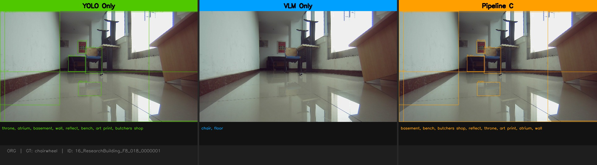
*GT: chairwheel. VLM-only: "chair, floor". Pipeline C adds spatial grounding but misses GT label — YOLOE detects region, VLM names it incorrectly. Illustrates OOV failure mode.*

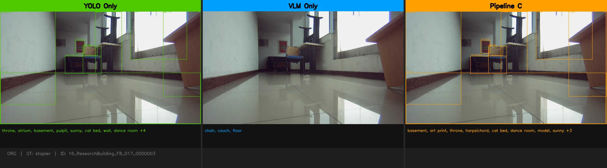
*GT: stapler. Neither pipeline recovers correct label. Spatial recall (bbox IoU) may still count as TP.*

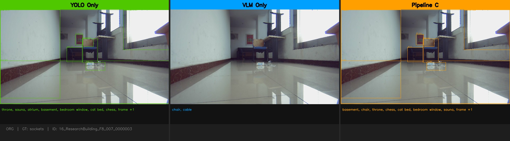
*GT: sockets. VLM-only detects "cable" — semantically closer than YOLOE's "throne". Illustrates the OOV vocabulary mismatch.*

**SODA-D dataset (outdoor urban, domain mismatch)**

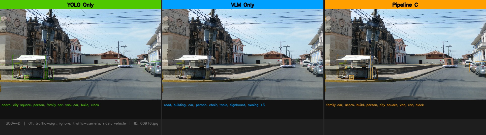
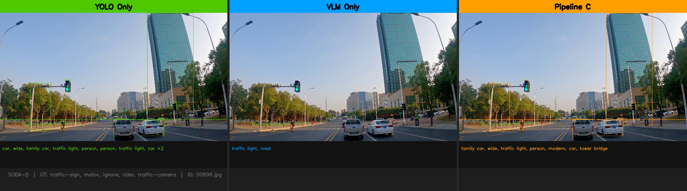
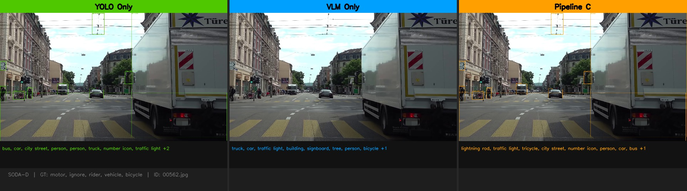
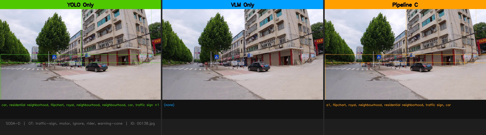

**DASH-B dataset (hallucination benchmark)**

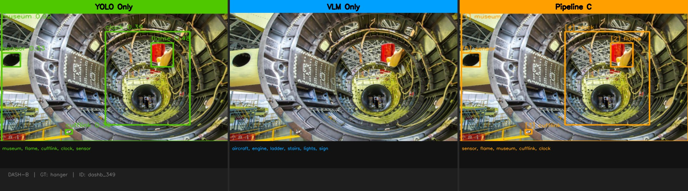
*GT absent: hanger. Pipeline C does not hallucinate it. VLM-only more likely to.*

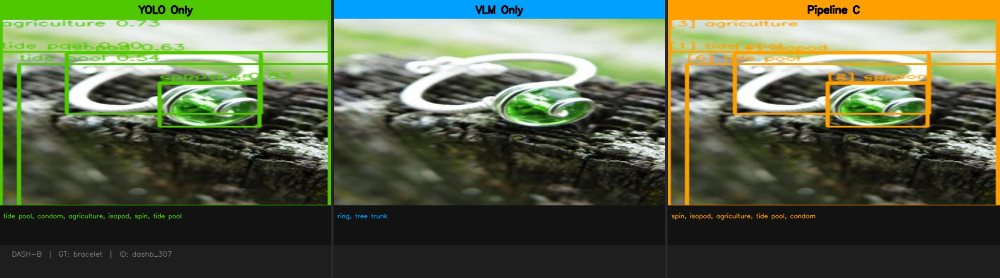
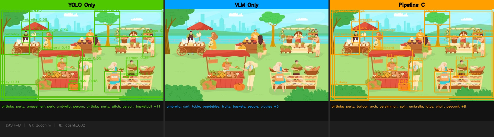

---

### Pipeline F — Prompt Engineering Variants (C | F-A | F-B | F-C)

**ORG dataset**

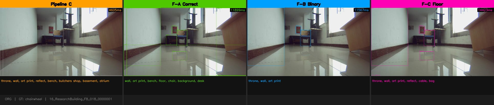
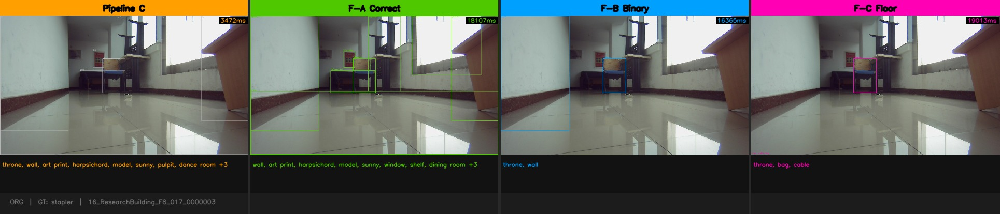
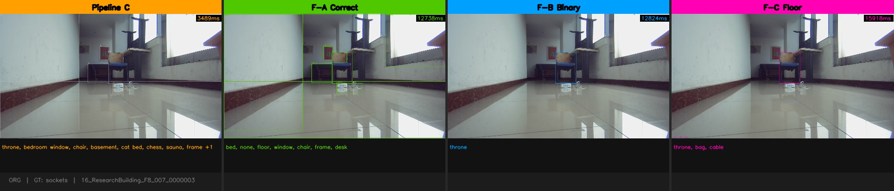

**SODA-D dataset**

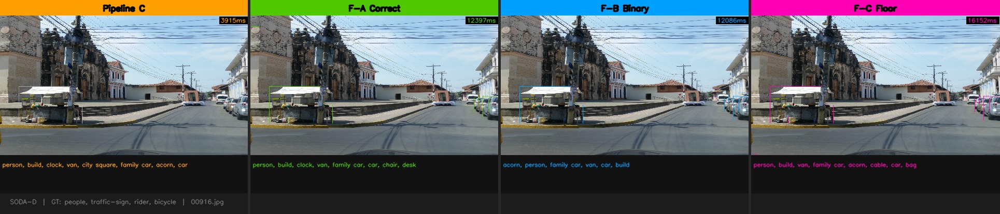
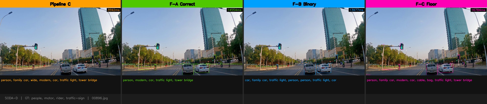
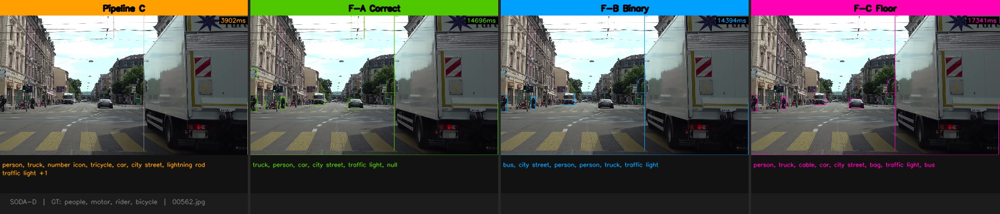
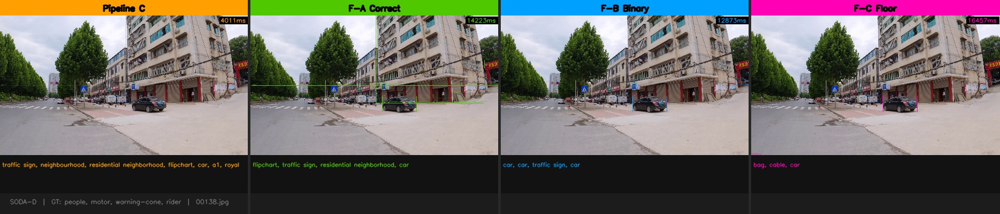

**DASH-B dataset**

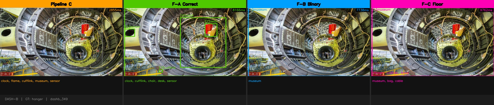
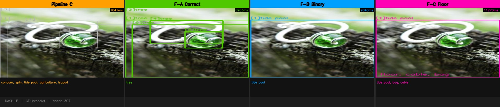
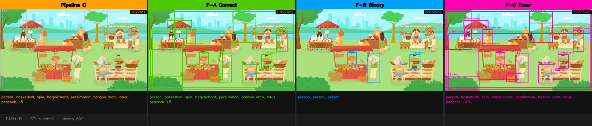

---

## Key Findings

1. **Spatial grounding reduces hallucination 38%** — DASH-B commission 0.130 → 0.080
2. **VLM-only fails completely on floor obstacles** — 0% recall, Pipeline C achieves 55.6%
3. **HSV cross-checking adds nothing** — Pipeline D = Pipeline C on all metrics
4. **Label-match rejection degrades OOV recall** — Pipeline E worse than C on ORG
5. **Minimum viable VLM is Qwen2.5-VL-3B** — 256M incapable, 500M too slow, 7B no gain
6. **YOLOE latency is negligible** — 44–76ms vs 1,750ms VLM, <4% of total
7. **INT8 viable for VRAM reduction** — 46% VRAM drop, accuracy preserved, latency +51%
8. **Prompt engineering does not help** — F-A/B/C: 4–5× latency, no recall improvement

---

## Honest Limitations

| Issue | Severity | Status |
|---|---|---|
| n=20 on ORG/SODA-D | 🔴 Reject-on-sight for venue submission | Pilot only — full run ~$50 |
| Single seed, no significance tests | 🔴 No CI on any number | McNemar test needed |
| No published baseline comparison | 🔴 Only compared to own degenerate baseline | GroundingDINO, Florence-2 needed |
| Precision = 7% on ORG | 🟡 High FP rate | Known, stated as limitation |
| SODA-D domain mismatch | 🟡 Outdoor dataset for indoor task | Retained for generalisation claim only |
| INT8 latency overhead | 🟡 bitsandbytes not production-ready | TensorRT INT8 would differ |
| Single-frame evaluation | 🟢 No temporal tracking | Future work |

---

## Questions for the Reviewer

1. Is the core claim defensible at n=20? Or is full-dataset eval a prerequisite for any feedback?
2. The precision = 7% on ORG — is this a framing problem or a fundamental problem?
3. YOLOE-pf produces semantically meaningless labels. We use it for spatial boxes only. Is this methodology sound or does it need justification?
4. Pipeline E (label-match rejection) degrades OOV recall. Is this worth a dedicated analysis section or a footnote?
5. If you greenlight the methodology — full eval budget is ~$50 on Modal A10G. Worth spending before venue selection?

---

## Compute Summary

| Run | GPU | Cost | Status |
|---|---|---|---|
| Pipeline B/C/D/E, Qwen3B, all datasets | A10G | ~$0.34 | Done |
| Pipeline C INT8, A10G | A10G | ~$0.34 | Done |
| Pipeline C BF16/INT8, RTX 3060 | RTX 3060 | $0.00 | Done |
| Model comparison (4 models) | A10G | ~$0.68 | Done |
| Visualization (10 images) | A10G | ~$0.15 | Done |
| Pipeline F prompt variants (10 images) | A10G | ~$0.20 | Done |
| **Total** | | **~$1.71** | |

Full dataset run if methodology approved: ~$50.

---

## Folder Structure

```
spatial-vlm-grounding/
  README.md                  ← this file
  viz/           ← 10 Pipeline C comparison images
  viz_f_outputs/viz_f/       ← 10 Pipeline F comparison images
                  
```
